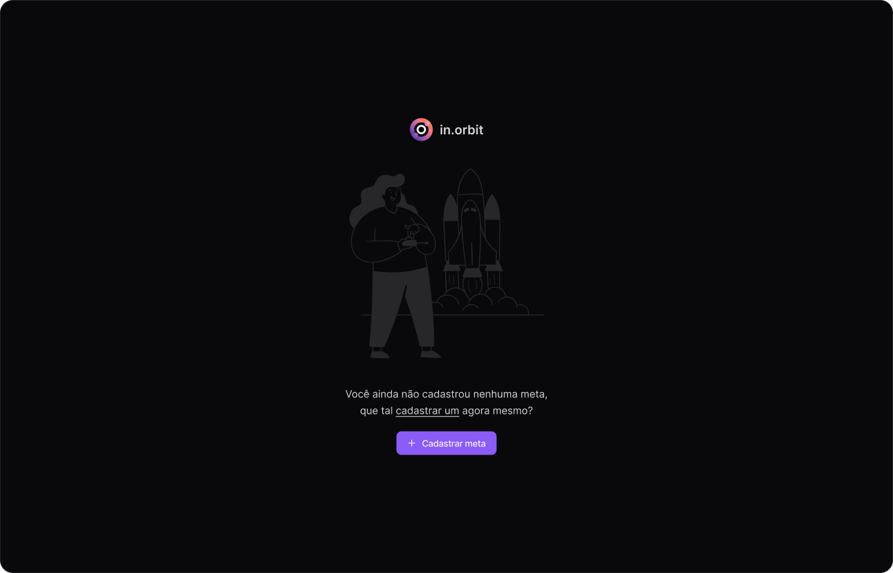

<h1 align="center"> InOrbit </h1>

Projeto para controlar as suas metas semanais. 

  <a href="#-tecnologias">Tecnologias</a>&nbsp;&nbsp;&nbsp;|&nbsp;&nbsp;&nbsp;
  <a href="#-layout">Layout</a>

 

  

## 🎓 Tecnologias

Esse projeto foi desenvolvido com as seguintes tecnologias:

- HTML e CSS
- Typescript | Angular
- Spring boot e Java
- MySql
- Git e Github
- Figma

## 🏯 Layout

Visualise o layout do projeto através [desse link](https://www.figma.com/design/xm31nRzMCgJbpB9pXAZSbE/NLW-Pocket-JS-%E2%80%A2-in.orbit-(Community)?m=auto&t=vcE3AsEbUHASfDNg-6). É necessário ter conta no [Figma](https://figma.com) para acessá-lo.

---

<h4 align="center">By: Isaluh - feat desgin: Rocketseat 🤍</h4>